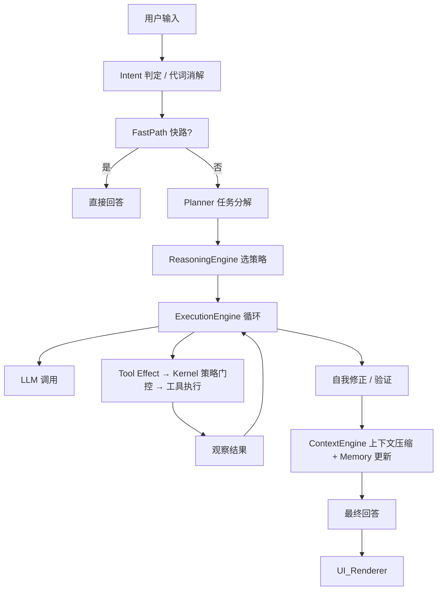

# LV Agent / OpenMythos 架构图

## 整体分层

```mermaid
graph TB
    subgraph UI
        UI_App[ui/app.py 主循环]
        UI_Renderer[ui/renderer.py / cards / banner / status_bar]
    end

    subgraph Core
        Agent[agent.py OpenMythosAgent]
        Config[config.py AgentConfig]
        Intent[intent.py / intent_classifier.py]
    end

    subgraph PlanningReasoning
        Planner[planning.py Planner]
        Reasoning[reasoning.py ReasoningEngine]
        Execution[execution_engine.py ExecutionEngine]
        Policies[policies.py CoT/ReAct/Verify/SuperAgent]
        Loop[LoopController 自适应循环]
        FastPath[fast_path.py FastPathRouter]
    end

    subgraph Harness
        Kernel[harness/kernel.py Capability Kernel]
        Events[harness/events.py / journal.py]
        Budget[harness/budget.py Ledger]
        Scheduler[harness/scheduler.py]
        LoopH[harness/loop.py AgentLoop]
        Session[harness/session.py]
        HotSwap[harness/hotswap.py HotSwapKernel]
    end

    subgraph Tools
        Registry[tools/__init__.py ToolRegistry]
        Web[web_search / web_fetcher]
        File[ file_ops / grep / glob / project_context ]
        Code[ python_exec / bash_exec / calculator ]
        Other[ git_ops / github_search / pdf_tool / weather / telegram / mcp ]
    end

    subgraph Memory
        MemoryMgr[memory.py MemoryManager]
        Context[context_engine.py ContextEngine]
        Wiki[wiki_memory.py LLM Wiki]
        Experience[experience.py ExperienceBuffer]
        MemSkill[memskill.py 记忆技能]
        SQLite[sqlite_memory.py / file_memory.py]
    end

    subgraph SelfEvolution
        Reflection[reflection.py]
        SelfCorr[self_correction.py]
        Evaluator[evaluator.py / evidence.py]
        Research[research_report.py 深度研究]
    end

    User --> UI_App
    UI_App --> Agent
    Agent --> Config
    Agent --> Intent
    Agent --> Planner
    Agent --> Reasoning
    Agent --> FastPath
    Agent --> Kernel
    Agent --> Registry

    Reasoning --> Execution
    Execution --> Policies
    Execution --> Loop

    Kernel --> Events
    Kernel --> Budget
    Kernel --> Scheduler
    Scheduler --> LoopH
    LoopH --> Session

    Registry --> Web
    Registry --> File
    Registry --> Code
    Registry --> Other

    Agent --> MemoryMgr
    MemoryMgr --> Context
    MemoryMgr --> Wiki
    MemoryMgr --> Experience
    MemoryMgr --> MemSkill
    MemoryMgr --> SQLite

    Agent --> Reflection
    Agent --> SelfCorr
    Agent --> Evaluator
    Agent --> Research

    HotSwap --> Kernel
    Kernel --> Agent
```



## 数据流



## Harness 微内核栈

```mermaid
graph BT
    Session[session.py Session]
    Loop[loop.py AgentLoop]
    Stream[stream.py EventBus]
    Scheduler[scheduler.py]
    Budget[budget.py Ledger/Limits]
    Kernel[kernel.py Policy-as-Data]
    Effects[effects.py Tool Effect 声明]
    Journal[journal.py Append-only JSONL]
    Events[events.py Immutable Events]
    Errors[errors.py ErrorKind]
```



## 模块映射

- **入口**: `__main__.py` → `ui/app.py`
- **核心**: `agent.py OpenMythosAgent`
- **配置**: `config.py`
- **推理**: `reasoning.py`, `execution_engine.py`, `planning.py`, `policies.py`, `fast_path.py`
- **Harness**: `harness/*`
- **工具**: `tools/*`
- **记忆**: `memory.py`, `context_engine.py`, `wiki_memory.py`, `experience.py`, `memskill.py`
- **自我进化**: `reflection.py`, `self_correction.py`, `evaluator.py`, `research_report.py`
- **UI**: `ui/*`
- **工具函数**: `utils/agent_utils.py`

## 关键特性

- 多策略推理 CoT / ReAct / Verify / SuperAgent / MCTS / SelfConsistency
- 自适应 Loop 控制 2~16 轮
- Harness 事件溯源、可重放、检查点、热插拔
- Hermes 式工具渐进披露
- 上下文压缩 512 token + 知识图谱长期记忆
- 深度研究模式 多 query 并行 + 报告生成
```

